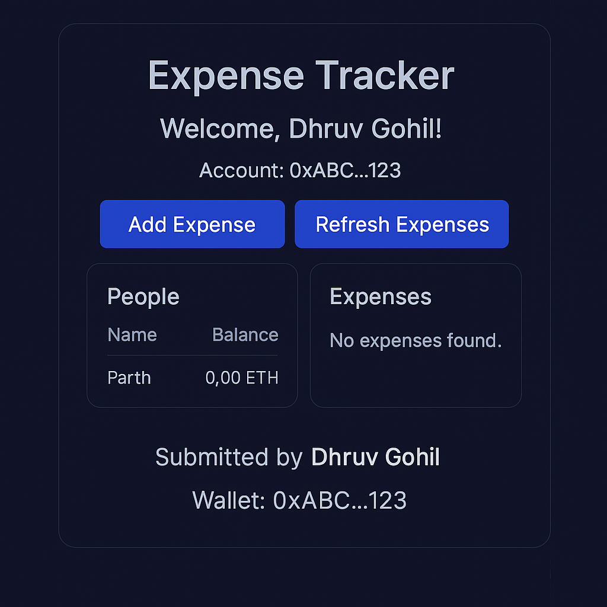

# BlockBase Project – Expense Tracker DApp 💸

Created by **Dhruv Gohil**

---

## 🧠 About the Project

This project is a decentralized expense tracker built using:

- **Solidity** (for smart contract)
- **React.js** (for frontend)
- **ethers.js** (for Web3 interactions)
- **MetaMask** & **Sepolia Testnet** for deployment and testing

---

## ✅ Features Implemented

### 🔒 Solidity Feature
**Get Total Number of Registered Users**
```solidity
function getTotalRegisteredPeople() public view returns (uint256)
```

This function returns how many users have registered in the app.

---

### 💻 JavaScript Feature
**Display Total Registered Users**

In `App.js`, this calls the Solidity function and displays:

> **"Total Registered Users: X"**

---

## 🚀 How to Run

1. Make sure you have:
   - Node.js and npm
   - MetaMask installed
   - Some Sepolia ETH

2. Extract the ZIP and run:
```bash
npm install
npm start
```

3. Connect MetaMask → Register → Add Expenses → See History

---

## 🖼️ Screenshot



---

## 📁 Folder Structure

- `contracts/BlockBase.sol` → Solidity code
- `src/App.js` → React frontend logic
- `src/App.css` → Styling
- `src/ExpenseTrackerABI.json` → ABI for smart contract

---

## 🙌 Mentored by FEC | Submitted by Dhruv Gohil